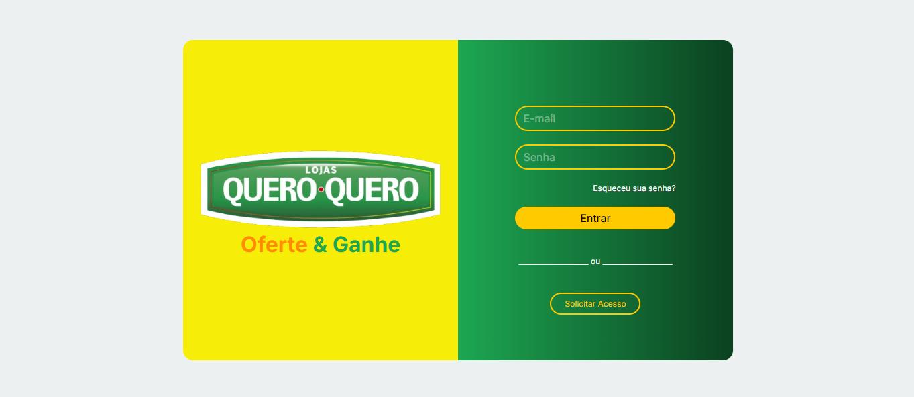
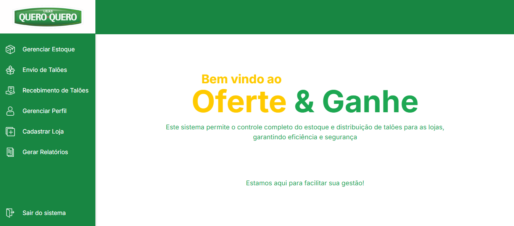
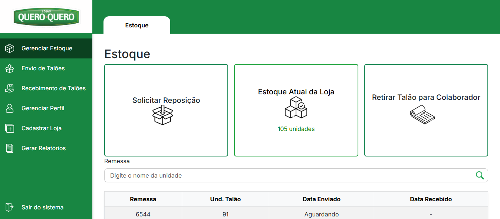

# Oferte & Ganhe ✨

**Oferte e Ganhe** é um sistema desenvolvido para o controle de envio e recebimento de talões entre lojas. Este projeto full stack foi criado como parte do treinamento do **QQ Tech 7**, programa de estágio da **Verde Card**.

O sistema é composto por um backend robusto e um frontend responsivo, proporcionando eficiência e organização no gerenciamento das transações entre lojas.

---

## 🛠️ Tecnologias Utilizadas

### Backend
- **Node.js**: Plataforma de execução de código JavaScript no servidor.
- **Express**: Framework para gerenciamento de rotas HTTP.
- **Sequelize**: ORM para interação com o banco de dados.
- **PostgreSQL**: Banco de dados utilizado.

### Frontend
- **HTML5**: Estrutura das páginas.
- **CSS3**: Estilização e layout.
- **JavaScript**: Lógica de interação do frontend.
- **Bootstrap**: Framework CSS para layouts responsivos e estilização.

---

## 📦 Dependências

### Backend
- **Tratamento de rotas HTTP**:  
  ```bash
  npm install express

- **Reset automático do servidor**:  
  ```bash
  npm install nodemon

- **Conexão com o banco de dados**:  
  ```bash
  npm install pg

- **Dependências para autenticação e criptografia**:  
  ```bash
  npm install jsonwebtoken body-parser bcrypt

- **Envio de e-mails e variáveis de ambiente**:  
  ```bash
  npm install nodemailer dotenv

- **Outras dependências**:  
  ```bash
  npm install cors sequelize

---

## 🖼️ Screenshots
Abaixo estão algumas imagens do projeto em funcionamento:


### Página inicial


### Página inicial


### Estoque


## 🚀 Como Rodar o Projeto
- **Instale as dependências: No diretório raiz do projeto, execute:**
   ```bash
  npm install

- ** Rodando o servidor: Para rodar o backend, use:**
   ```bash
   npm start

**Desenvolvedor: [Willian Rodrigues]**
**E-mail: [willianrdriguesz@gmail.com]**


